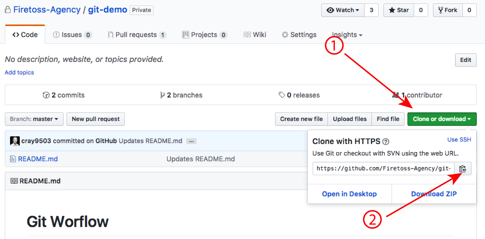
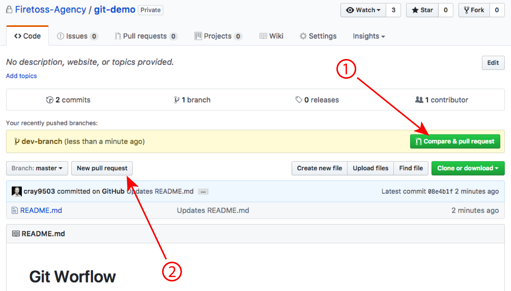

# FireStarter
Firetoss Theme Base

# Domain of Ownership

## Discussion Needed
<ul>
<li>Vendor Libraries</li>
<li>Naming Conventions</li>
</ul>

## Evan
<ul>
<li>ACF Layouts</li>
<li><code>/scss/modules/woo</code></li>
</ul>

## Scott
<ul>
<li><code>/scss/modules</code></li>
<li><code>/layout-sections</code></li>
</ul>

## Josh
<ul>
<li><code>/scss/admin</code></li>
</ul>


# Git Worflow
This document describes a universal git workflow that should be used when contributing to projects on GitHub. It assumes a very basic understanding of git (commits, branches, etc.) using the command line.

## Cloning the repository

**Note: The steps in this section only need to be performed ONCE per repository.**

1. **Clone the repository.** Click the green "<font color="green">Clone or download</font>" button <font color="blue">①</font>,
   and copy the url <font color="blue">②</font> and type

   <code>git clone <i>clone-url</i></code>

   at the terminal. Replace *`clone-url`* with the url that has been copied to
   your clipboard. For Firetoss-Agency/git-demo, it will be
   `https://github.com/Firetoss-Agency/git-demo.git`.

   


Remember, the above step only needs to be performed once per
repository.

## Making changes

Before you make any changes, you should make a branch. Remember to **never
commit to master**. The command `git status` will tell you what branch you are
on. I recommend putting the git branch in your command prompt, so that you
will always know what branch you are on. See
[this guide](http://stackoverflow.com/a/24716445/161801) on how to do this.
Or see [this guide](https://github.com/robbyrussell/oh-my-zsh/wiki/Installing-ZSH) on how to set up Oh My Zsh (my preference).

It is important that you never commit to master because master will be the
branch that you pull upstream changes from (e.g., changes from
Firetoss-Agency/git-demo).

1. **Update master.** Before you make any changes, first checkout master

   ```
   git checkout master
   ```

   and pull in the latest changes

   ```
   git pull origin
   ```

   This will make it so that your changes are against the very latest master,
   which will reduce the likelihood of merge conflicts due to your changes
   conflicting with changes made by someone else.

2. **Create a branch.** Once you have done this, create a new branch. You
   should make a branch name that is short, descriptive, and unique.

   To create the branch, run

   <code>
   git checkout -b <i>branch-name</i>
   </code>

   (replace *`branch-name`* with the branch name you chose). This will create a
   new branch and check it out. You can verify this with `git status`.

3. **Make your changes and commit them.** Once you have created your branch,
   make your changes and commit them. Remember to keep your commits atomic,
   that is, each commit should represent a single unit of change. Also,
   remember to write helpful commit messages, so that someone can understand
   what the commit does just from reading the message without having to read
   the diff.

   For example, at the command line, this might look like

   <pre><code>git add <i>filename</i>
   git commit -m "<i>Commit message</i>"
   </code></pre>

   (replace *`Commit message`* with the helpful commit message).

4. **Push up your changes.**  Push your changes. Do this by
   running

   <code>
   git push origin <i>branch-name</i>
   </code>

   (replace *`branch-name`* with the name of the branch).

5. **Make a pull request.** If you then go to the repo on GitHub, you should
   see a button <font color="blue">①</font> to create a pull request from your branch. It will look
   something like this:

   

   If you do not see this, select the **<i>New pull request</i>** button <font color="blue">②</font>.
   Once doing this, you will be presented with a page. This page will show you the diff of the changes. Double check them to      make sure you are making a pull request against the right branch.

   

   Things to check here are that the branch for the upstream repo (Firetoss-Agency) is master, and that the branch you are comparing is the branch you wish to make the pull request from.

   Once you are done, click the **<i>Create pull request</i>** button.

## Important points

The important things to remember from this document are

1. You only need to clone once per repository.

2. Never commit to master. Create a branch and commit to it.

3. Use `git status` often to check what branch you are on and see if you have
   any uncommitted changes.

4. Be descriptive in your branch names, commit messages, and pull request
   title and descriptions.

6. Once you have a pull request for a branch, you can push additional changes
   to the same branch and they will be added to the pull request
   automatically. You should never create a new pull request for the same
   branch.

7. Comment on the pull request when you want people to know that you have
   pushed new changes. Although GitHub does notify people of commit pushes,
   people are more likely notice your changes if you leave a comment.